# Task Managers for Claude Code

From chaos to clarity in agent workflows

<div class="abs-br m-6 text-sm opacity-60">
Brett Beutell · @bbeutell
</div>

<!--
Welcome everyone! Today I want to show you something a bit different...
-->

---

# This Talk Is a Demo

Every slide you're seeing was tracked as a task

```
CCTA-vojsagkz [in-progress] Slide content: Meta demo opening
CCTA-dtwfhyzi [todo] Deploy Slidev deck as Cloudflare Worker
CCTA-fesnsfxb [todo] Create private GitHub repo and push initial code
CCTA-fogpceik [todo] Slide content: Plan → Execute → Review framework
CCTA-gyivmtgb [todo] Slide content: Closing and resources
CCTA-mspiiwwi [todo] Slide content: Pain points of agent work
CCTA-pqcfzgfs [todo] Slide content: The landscape of agent-native task managers
CCTA-bulmdiry [done] Initialize Slidev presentation with Bun
CCTA-gszknhfx [done] Set up Poke notification script for slide progress
```

<v-click>

**A Claude Code agent built this presentation, tracking its own work with `fp`**

</v-click>

<!--
This is actual output from fp tree, right now.
I'm not just talking about task managers - I'm using one to build this talk.
-->

---

# The Agent Workflow

<div class="grid grid-cols-3 gap-8 mt-8">

<div class="text-center">
<div class="text-4xl mb-2">📋</div>

### 1. Claim

```bash
fp issue update \
  --status in-progress \
  CCTA-vojsagkz
```

</div>

<div class="text-center">
<div class="text-4xl mb-2">⚡</div>

### 2. Work

```bash
# Make changes
git commit -m "feat: ..."

# Log progress
fp comment CCTA-vojsagkz \
  "Added slides..."
```

</div>

<div class="text-center">
<div class="text-4xl mb-2">✅</div>

### 3. Complete

```bash
fp issue update \
  --status done \
  CCTA-vojsagkz
```

</div>

</div>

<v-click>

<div class="mt-8 text-center text-lg opacity-80">

Every commit links to an issue. Every session has context.

</div>

</v-click>

<!--
This is the basic pattern. Claim work, do work, mark done.
The magic is that this state persists across sessions and context windows.
-->

---
layout: section
---

# The Pain

Why agents struggle without structured memory

<!--
Let's talk about what's broken. Because if you've used Claude Code for any serious project, you've felt these problems.
-->

---

# The "50 First Dates" Problem

<div class="text-xl mt-8 opacity-80 italic">
"Every morning, your AI wakes up with no memory of yesterday."
</div>

<div class="text-sm mt-2 opacity-60">— Steve Yegge</div>

<v-clicks>

<div class="mt-8">

- **New context window** = clean slate
- Yesterday's progress? Gone.
- That brilliant plan you worked out together? Forgotten.
- Your coding style preferences? Explain them again.

</div>

<div class="mt-6 p-4 bg-orange-500/10 rounded-lg">

**The irony:** The agent was doing great work. You were making progress. Then the session ended.

</div>

</v-clicks>

<!--
Steve Yegge coined this analogy - like the movie 50 First Dates where Drew Barrymore's character has no memory of previous days.
Every session starts from scratch.
-->

---

# Your Brain Lives Elsewhere

<div class="grid grid-cols-2 gap-8 mt-8">

<div>

### Where the plan lives

- Your head
- Notion / Linear / Jira
- Random Slack messages
- That email you sent yourself

</div>

<div>

### Where Claude works

- The current context window
- *(that's it)*

</div>

</div>

<v-click>

<div class="mt-8 p-4 bg-red-500/10 rounded-lg text-center">

**Gap:** You constantly re-explain the big picture

"Remember we're building a billing system..."

"The goal is to migrate users to the new API..."

</div>

</v-click>

<!--
This is the fundamental disconnect. You have all this context about what you're building, why, what's next.
But every session you need to reload that into the agent.
-->

---

# Context Rot

<div class="mt-8">

Session 1: "Let's build the authentication system"

<v-clicks>

Session 5: "Wait, what approach did we decide on for refresh tokens?"

Session 10: "Did we handle the edge case where..."

Session 20: "I think we need to refactor this, but I'm not sure what the original design was"

</v-clicks>

</div>

<v-click>

<div class="mt-8 p-4 bg-yellow-500/10 rounded-lg">

**Each session starts slightly out of sync.** Context doesn't just disappear — it degrades over time.

</div>

</v-click>

<!--
Even when you try to maintain continuity, information degrades.
You remember differently than the agent remembers.
Neither of you remember exactly what was decided.
-->

---

# Markdown Litter

<div class="mt-8 font-mono text-sm bg-neutral-800 p-4 rounded-lg">

```
project/
├── TODO.md          (last updated 3 weeks ago)
├── PLAN.md          (from that one session)
├── NOTES.md         (who wrote this?)
├── ARCHITECTURE.md  (is this current?)
├── .claude/
│   └── TODO.md      (wait, there's another one?)
└── docs/
    └── ROADMAP.md   (definitely stale)
```

</div>

<v-clicks>

<div class="mt-6">

- Agents create markdown files to "remember"
- These files go stale almost immediately
- You don't want to commit them
- But you need *something* for context

</div>

<div class="mt-4 text-lg opacity-80">

**Result:** A graveyard of good intentions

</div>

</v-clicks>

<!--
Every agent session leaves behind markdown artifacts.
The agent is trying to help! But without a real system, these files just become noise.
-->

---

# The PR Review Problem

<div class="grid grid-cols-2 gap-8 mt-8">

<div>

### Agent makes 47 commits

```
feat: add user model
feat: add validation
fix: validation edge case
refactor: extract helper
feat: add tests
fix: test was wrong
...
```

</div>

<div v-click>

### You need to review

- What was the plan?
- Why these decisions?
- Did anything get missed?
- Is this even right?

</div>

</div>

<v-click>

<div class="mt-8 p-4 bg-purple-500/10 rounded-lg">

**The trust problem:** You can't verify work you can't understand.

And you can't understand work without context.

</div>

</v-click>

<!--
This is maybe the biggest pain point for production use.
The agent can do a LOT of work. But how do you validate it?
Without structured tracking, you're just hoping it did the right thing.
-->

---
layout: section
---

# The Good News

These problems are solvable — with the right tooling

<!--
Here's the thing: all of these problems have solutions.
We just need tools designed for agent workflows, not human workflows.
-->

---

## Demo: Live Agent Workflow

*This presentation was built by a Claude Code agent using an agent-native task manager*

- Watch the issue tracker in real-time
- See how progress is logged
- Observe the Plan → Execute → Review cycle

---
layout: section
---

# The Framework

Plan → Execute → Review

<!--
Now let's talk about the solution. A simple framework that makes agent work actually work.
-->

---

# Plan → Execute → Review

```mermaid {scale: 0.9}
graph LR
    P[📋 PLAN] --> E[⚡ EXECUTE]
    E --> R[🔍 REVIEW]
    R --> P

    style P fill:#3b82f6,stroke:#1d4ed8,color:#fff
    style E fill:#22c55e,stroke:#16a34a,color:#fff
    style R fill:#a855f7,stroke:#7c3aed,color:#fff
```

<div class="flex justify-center mt-12">



</div>

<v-clicks>

<div class="grid grid-cols-3 gap-4 mt-8 text-center">

<div class="p-4 bg-blue-500/10 rounded-lg">

**PLAN**

Break work into atomic tasks

</div>

<div class="p-4 bg-green-500/10 rounded-lg">

**EXECUTE**

Focused work with context

</div>

<div class="p-4 bg-purple-500/10 rounded-lg">

**REVIEW**

Per-task, not per-PR

</div>

</div>

</v-clicks>

<!--
This is the core cycle. Plan your work, execute with focus, review incrementally.
Each phase feeds into the next. Let's look at each one.
-->

---

# 📋 PLAN

<div class="grid grid-cols-2 gap-8 mt-8">

<div>

### Break work into atomic tasks

<v-clicks>

- 1-3 hours of focused work
- Clear scope, clear completion criteria
- Dependencies explicit
- One responsibility per task

</v-clicks>

</div>

<div v-click>

```bash
fp issue create \
  --title "Add user auth middleware" \
  --parent EPIC-123

fp issue create \
  --title "Implement refresh tokens" \
  --parent EPIC-123 \
  --depends AUTH-001
```

</div>

</div>

<v-click>

<div class="mt-8 p-4 bg-blue-500/10 rounded-lg">

**Key insight:** A solid plan = easier execution. Agents (and humans) work better with clear scope.

</div>

</v-click>

<!--
Planning is about breaking work into chunks that fit in an agent's context window.
Not just small tasks - atomic tasks with clear boundaries.
The task manager becomes your shared scratch notes with Claude.
-->

---

# 📋 PLAN: Sharing Your Scratch Notes

<div class="text-lg mt-8 opacity-80">

Developers often keep scratch notes as they develop:

</div>

<div class="grid grid-cols-2 gap-8 mt-4">

<div>

### Before task managers

- Notes in your head
- Random text file
- Slack DM to yourself
- That sticky note somewhere

</div>

<div v-click>

### With agent-native task managers

- Structured issues
- Dependencies tracked
- Progress logged
- **Claude can read them**

</div>

</div>

<v-click>

<div class="mt-8 p-4 bg-blue-500/10 rounded-lg text-center text-lg">

**A task manager lets you share your scratch notes with Claude**

It's a shared brain — persistent, structured, collaborative

</div>

</v-click>

<!--
This is the key mental model shift. You're not just managing tasks - you're sharing your thinking with the agent.
Your scratch notes become shared context.
-->

---

# ⚡ EXECUTE

<div class="grid grid-cols-2 gap-8 mt-8">

<div>

### Focused, scoped work

<v-clicks>

- Agent claims one task
- Full context loaded
- Works to clear completion criteria
- Commits link to issues

</v-clicks>

</div>

<div v-click>

```bash
# Start of session
fp issue update \
  --status in-progress AUTH-002

fp context AUTH-002
# → Loads issue, parent, dependencies

# During work
git commit -m "feat(AUTH-002): ..."

# Progress logging
fp comment AUTH-002 \
  "Implemented token refresh,
   working on expiry handling..."
```

</div>

</div>

<v-click>

<div class="mt-6 p-4 bg-green-500/10 rounded-lg">

**Structured memory persists across sessions.** Context window resets — the task manager doesn't.

</div>

</v-click>

<!--
Execution is where agents shine. Give them a clear task, loaded context, and let them work.
The magic is that all this context persists. Next session, pick up where you left off.
-->

---

# ⚡ EXECUTE: Easy Offloading

<div class="mt-8">

During focused work, you notice something unrelated:

</div>

<v-clicks>

<div class="mt-4 p-4 bg-neutral-800 rounded-lg font-mono text-sm">

"Hmm, that test file should be refactored... but that's not what I'm working on"

</div>

<div class="mt-6">

### Old way: Mental tax

- Remember it (you won't)
- Add a TODO comment (goes stale)
- Context switch now (loses focus)

</div>

<div class="mt-6">

### With task managers: Quick capture

```bash
fp issue create --title "Refactor auth tests" --parent EPIC-123
# → Created AUTH-005
```

Back to your actual work. Zero context switch.

</div>

</v-clicks>

<!--
This is one of the underrated benefits. You or the agent can capture new work items without losing focus.
No mental overhead of remembering things for later.
-->

---

# 🔍 REVIEW

<div class="text-xl mt-8 opacity-80">

More execution can happen now → Review is the bottleneck

</div>

<div class="grid grid-cols-2 gap-8 mt-8">

<div>

### The old review model

<v-clicks>

- Wait for PR
- 47 commits to review
- "What was this change about?"
- Missing context

</v-clicks>

</div>

<div v-click>

### Task-based review

<v-clicks>

- Review per-task, not per-PR
- See what changed for AUTH-002
- Progress comments explain why
- Smaller, focused diffs

</v-clicks>

</div>

</div>

<v-click>

<div class="mt-6 p-4 bg-purple-500/10 rounded-lg">

**Tools like `fp issue diff` and Vibe Kanban diffs make this easier:** See exactly what changed for each task.

</div>

</v-click>

<!--
Review is where most teams are struggling now. Agents can produce so much code.
The solution is reviewing in smaller chunks, tied to tasks, with context preserved.
-->

---

# 🔍 REVIEW: Per-Task Diffs

```bash
$ fp issue diff AUTH-002

Showing changes for AUTH-002: Implement refresh tokens
  Status: done
  Commits: 3 (abc123, def456, ghi789)

src/auth/refresh.ts   | 47 ++++++++++++++++++++++
src/auth/middleware.ts | 12 ++++++
tests/auth/refresh.test.ts | 38 ++++++++++++++++++
```

<v-clicks>

<div class="mt-8 grid grid-cols-2 gap-8">

<div class="p-4 bg-neutral-800 rounded-lg">

**What you see:** Just the changes for this task

</div>

<div class="p-4 bg-neutral-800 rounded-lg">

**What you skip:** All the other work that doesn't matter for this review

</div>

</div>

<div class="mt-6 text-center text-lg opacity-80">

Review becomes tractable when you review one thing at a time

</div>

</v-clicks>

<!--
This is the key insight. Don't review the whole PR at once.
Review task by task. See the changes in context.
This is how you can actually validate agent work.
-->

---

# The Cycle in Practice

<div class="text-sm mt-4">

```
Session 1                     Session 2                     Session 3
─────────                     ─────────                     ─────────
fp tree                       fp tree                       fp tree
  AUTH-001 [done]              AUTH-001 [done]              AUTH-001 [done]
  AUTH-002 [in-progress]  →    AUTH-002 [done]         →    AUTH-002 [done]
  AUTH-003 [todo]              AUTH-003 [in-progress]       AUTH-003 [done]
                               AUTH-004 [todo]              AUTH-004 [in-progress]

Claim → Execute → Review      Claim → Execute → Review      Claim → Execute → Review
```

</div>

<v-clicks>

<div class="mt-6 grid grid-cols-3 gap-4">

<div class="p-3 bg-blue-500/10 rounded-lg text-center text-sm">

**Context preserved**

Agent knows what's done

</div>

<div class="p-3 bg-green-500/10 rounded-lg text-center text-sm">

**Progress visible**

You see exactly where things are

</div>

<div class="p-3 bg-purple-500/10 rounded-lg text-center text-sm">

**Review tractable**

One task at a time

</div>

</div>

<div class="mt-6 p-4 bg-orange-500/10 rounded-lg text-center">

**The cycle continues across sessions, contexts, and even different agents**

</div>

</v-clicks>

<!--
This is what it looks like in practice. Each session picks up where the last left off.
The state is always clear. Review happens incrementally.
This is sustainable agent work.
-->

---
layout: section
---

# The Landscape

Agent-native task managers

<!--
So where can you get these benefits? Let's look at the tools that exist today.
-->

---

# A New Category: Agent-Native

<div class="text-lg mt-4 opacity-80">

Task managers designed for AI agents, not retrofitted for them

</div>

<v-clicks>

<div class="mt-8 grid grid-cols-2 gap-8">

<div class="p-4 bg-neutral-800 rounded-lg">

### Traditional tools

- Jira, Linear, Asana
- Web UIs for humans
- API access as afterthought
- Heavy, opinionated

</div>

<div class="p-4 bg-green-500/10 rounded-lg">

### Agent-native tools

- CLI-first interfaces
- Git-integrated storage
- Lightweight, focused
- Built for context loading

</div>

</div>

<div class="mt-6 text-center text-lg">

**Key insight:** Agents thrive with tools designed for how they work

</div>

</v-clicks>

<!--
This is a new category. These tools aren't adaptations of existing project management software.
They're purpose-built for agent workflows.
-->

---

# The Landscape Today

<div class="grid grid-cols-5 gap-4 mt-8 text-center text-sm">

<div class="p-4 bg-neutral-800 rounded-lg">
<div class="text-2xl mb-2">🔮</div>
<div class="font-bold">Beads</div>
<div class="opacity-60 mt-2">Git-based graph</div>
</div>

<div class="p-4 bg-neutral-800 rounded-lg">
<div class="text-2xl mb-2">⚡</div>
<div class="font-bold">fp</div>
<div class="opacity-60 mt-2">Local-first CLI</div>
</div>

<div class="p-4 bg-neutral-800 rounded-lg">
<div class="text-2xl mb-2">📊</div>
<div class="font-bold">Vibe Kanban</div>
<div class="opacity-60 mt-2">Multi-agent</div>
</div>

<div class="p-4 bg-neutral-800 rounded-lg">
<div class="text-2xl mb-2">📋</div>
<div class="font-bold">Taskmaster</div>
<div class="opacity-60 mt-2">PRD → Tasks</div>
</div>

<div class="p-4 bg-neutral-800 rounded-lg">
<div class="text-2xl mb-2">🫘</div>
<div class="font-bold">Beans</div>
<div class="opacity-60 mt-2">Flat-file MD</div>
</div>

</div>

<v-click>

<div class="mt-8 p-4 bg-blue-500/10 rounded-lg text-center">

All open source. All emerging in the last few months. The space is moving fast.

</div>

</v-click>

<!--
Here's the landscape as of today. Five tools, all open source, all with different approaches.
Let's look at what makes each one unique.
-->

---

# Tool Deep Dive

<div class="grid grid-cols-2 gap-6 mt-6 text-sm">

<div class="p-4 bg-neutral-800 rounded-lg">

### 🔮 Beads <span class="opacity-60 text-xs">— Steve Yegge</span>

- **Storage:** Git-based issue tracker
- **Superpower:** Dependency-aware graph
- **Deploy:** Single Go binary
- **Claim:** Vibe-coded in 6 days

<v-click>

*"50 First Dates" problem coined here*

</v-click>

</div>

<div class="p-4 bg-neutral-800 rounded-lg">

### ⚡ fp <span class="opacity-60 text-xs">— fp.dev</span>

- **Storage:** Local-first, per-project
- **Superpower:** Context loading per session
- **Deploy:** CLI (`brew install fp`)
- **Philosophy:** "Shared brain with Claude"

<v-click>

*This talk is built with fp*

</v-click>

</div>

<div class="p-4 bg-neutral-800 rounded-lg">

### 📊 Vibe Kanban <span class="opacity-60 text-xs">— BloopAI</span>

- **Storage:** Git worktrees
- **Superpower:** Multi-agent orchestration
- **Deploy:** MCP server + visual board
- **Killer feature:** Per-task diffs

<v-click>

*For parallel agent work*

</v-click>

</div>

<div class="p-4 bg-neutral-800 rounded-lg">

### 📋 Taskmaster <span class="opacity-60 text-xs">— Eyal Toledano</span>

- **Storage:** JSON task files
- **Superpower:** PRD parsing → tasks
- **Deploy:** MCP integration
- **Fits:** Cursor, Windsurf, etc.

<v-click>

*From spec to tasks automatically*

</v-click>

</div>

</div>

<!--
Four of the five tools. Each has a different philosophy and workflow.
Beads is graph-first. fp is CLI-first. Vibe Kanban is visual. Taskmaster starts from PRDs.
-->

---

# Tool Deep Dive (cont.)

<div class="grid grid-cols-2 gap-8 mt-8">

<div class="p-4 bg-neutral-800 rounded-lg">

### 🫘 Beans <span class="opacity-60 text-xs">— Hendrik Mans</span>

- **Storage:** Flat-file markdown in `.beans/`
- **Superpower:** GraphQL query engine (token efficient)
- **Deploy:** CLI + TUI interface
- **Philosophy:** Human-readable, agent-queryable

<v-click>

*Markdown files that don't go stale*

</v-click>

</div>

<div v-click class="p-4 bg-blue-500/10 rounded-lg">

### Pick based on your workflow

| If you need... | Try... |
|---------------|--------|
| Dependency graphs | Beads |
| CLI + context loading | fp |
| Visual + multi-agent | Vibe Kanban |
| PRD → tasks | Taskmaster |
| Token-efficient queries | Beans |

</div>

</div>

<v-click>

<div class="mt-6 p-4 bg-orange-500/10 rounded-lg text-center">

**No "best" tool.** Pick what fits how you work. They all solve the core problem: persistent agent memory.

</div>

</v-click>

<!--
Beans rounds out the five. And here's the key takeaway: they all solve the same fundamental problem
but with different philosophies. Try a few and see what clicks.
-->

---
layout: section
---

# Key Takeaway

The "shared brain" with your agent

<!--
Let's wrap up with the core insight from today.
-->

---

# A Task Manager Is a Shared Brain

<div class="grid grid-cols-2 gap-8 mt-8">

<div>

### What developers already do

<v-clicks>

- Keep scratch notes while coding
- Track TODOs in your head
- Remember context between sessions
- Know what's next

</v-clicks>

</div>

<div v-click>

### What agents can't do (alone)

<v-clicks>

- Remember across context windows
- Know what you decided yesterday
- See the bigger picture
- Track their own progress

</v-clicks>

</div>

</div>

<v-click>

<div class="mt-8 p-6 bg-blue-500/20 rounded-lg text-center text-xl">

**A task manager lets you share those notes with Claude**

Persistent · Structured · Collaborative

</div>

</v-click>

<!--
This is the mental model shift. You already keep notes. A task manager just makes them shareable with your agent.
It's not about managing the agent - it's about thinking together.
-->

---

# Get Started

<div class="text-lg mt-4 opacity-80 text-center">

Try one of these tools on your next project — start small, even just tracking tasks helps

</div>

<div class="grid grid-cols-5 gap-4 mt-8 text-center text-sm">

<a href="https://fp.dev" target="_blank" class="p-4 bg-neutral-800 rounded-lg hover:bg-neutral-700 transition no-underline">
<div class="text-2xl mb-2">⚡</div>
<div class="font-bold">fp</div>
<div class="opacity-60 mt-1 text-xs">fp.dev</div>
</a>

<a href="https://github.com/steveyegge/beads" target="_blank" class="p-4 bg-neutral-800 rounded-lg hover:bg-neutral-700 transition no-underline">
<div class="text-2xl mb-2">🔮</div>
<div class="font-bold">Beads</div>
<div class="opacity-60 mt-1 text-xs">steveyegge/beads</div>
</a>

<a href="https://github.com/BloopAI/vibe-kanban" target="_blank" class="p-4 bg-neutral-800 rounded-lg hover:bg-neutral-700 transition no-underline">
<div class="text-2xl mb-2">📊</div>
<div class="font-bold">Vibe Kanban</div>
<div class="opacity-60 mt-1 text-xs">BloopAI/vibe-kanban</div>
</a>

<a href="https://github.com/eyaltoledano/claude-task-master" target="_blank" class="p-4 bg-neutral-800 rounded-lg hover:bg-neutral-700 transition no-underline">
<div class="text-2xl mb-2">📋</div>
<div class="font-bold">Taskmaster</div>
<div class="opacity-60 mt-1 text-xs">eyaltoledano/claude-task-master</div>
</a>

<a href="https://github.com/hmans/beans" target="_blank" class="p-4 bg-neutral-800 rounded-lg hover:bg-neutral-700 transition no-underline">
<div class="text-2xl mb-2">🫘</div>
<div class="font-bold">Beans</div>
<div class="opacity-60 mt-1 text-xs">hmans/beans</div>
</a>

</div>

<v-click>

<div class="mt-8 p-4 bg-green-500/10 rounded-lg text-center">

**All open source. All free. Pick one and try it today.**

</div>

</v-click>

<!--
These are the links. All open source. fp.dev for fp, then the GitHub repos for everything else.
Don't overthink it - just pick one and start using it.
-->

---
layout: center
---

<div class="text-center">

# Thank You

<div class="mt-8 text-2xl">

**Brett Beutell**

</div>

<div class="mt-4 text-lg opacity-80">

@bbeutell

</div>

<v-click>

<div class="mt-12 p-4 bg-neutral-800 rounded-lg inline-block text-sm">

*This presentation was built by a Claude Code agent*

*tracking its own work with fp*

</div>

</v-click>

</div>

<!--
Thank you! This talk was genuinely built by Claude Code using fp to track every slide as a task.
I'm happy to answer questions about agent workflows, task managers, or how this presentation was made.
-->
